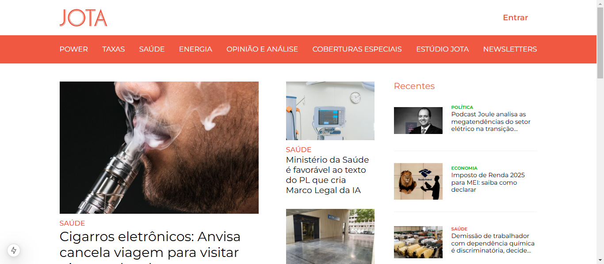
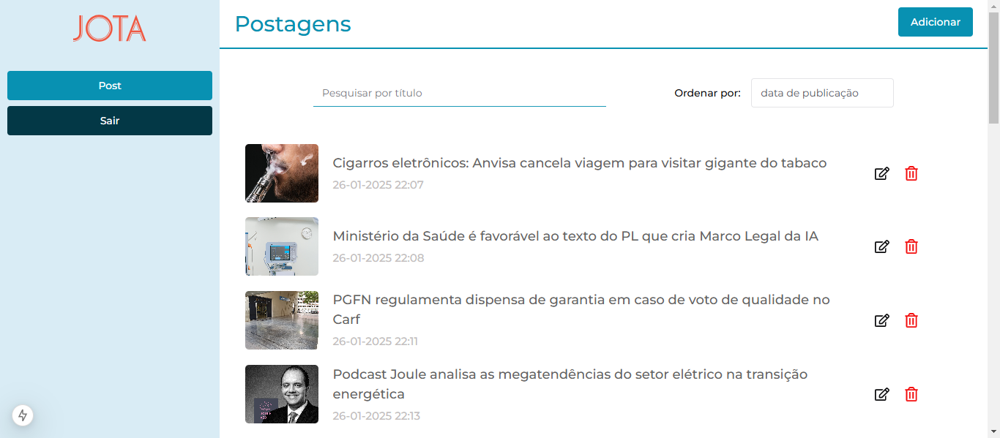

# News Portal

This project is a News Portal where users can view the latest news articles. It also includes an admin panel to register new news articles.

## ✨ Feature
- **User Access**: Clients can view all the latest news on the portal.
- **Admin Access**: Admin users can register new news articles to keep the portal up to date.
- **Testing**: Testing with Cypress, an end-to-end testing framework.

## 🎈 Tech Stack
- **Frontend**: Built with Next.js, a React framework.
- **Styling**: Styled using Chakra UI, a simple, modular, and accessible component library.
- **Backend**: You can check [here](https://github.com/amandafuruta/news-portal-backend)

Feb/2025

